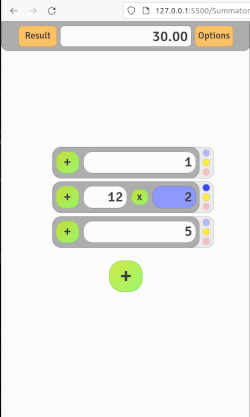

# Summator
Summator App for easy calculations

Create app for marketplace salesman to fast calculations and easy sale manegment.

## MVP Sprint
- Main logic done.
- UI and almost all css styles done.

---

- [ ] To investigate necesity off using all operators signs in main operation modal. Maybe "+" and "-" will be enougth.

Sprinty
Epik
SAD-8

Setup Summator App development
Gotowe
Epik
SAD-16

MVP
Gotowe
Epik
SAD-23

## Upgrade 1

- After 1 sprint ideas
    - Improve header button style animation and hover
    - Add animations for closing item
    - Advanced logic operations with mod slider
    - Add to header history of deleted items mean Trash
    - Input main validator only numbers
    - Switch on off opacity color when turned off
    - Slider mod inside operator popup and logic
    - If mod exist mod indicator on

- Modal input slider repair closing

- Fix delete item from array

- Main Input supose to show value after modification (if mod exist)

- Old and Actual input are seen in Input Main.

- When Switch off result should update

---

--- 
