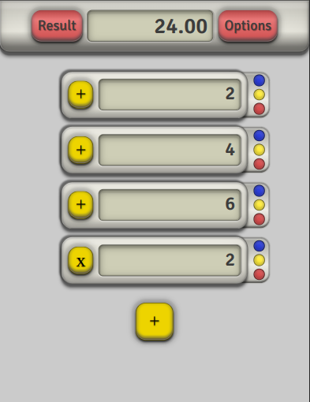
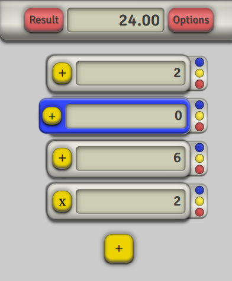
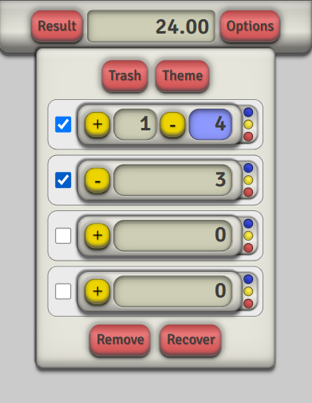
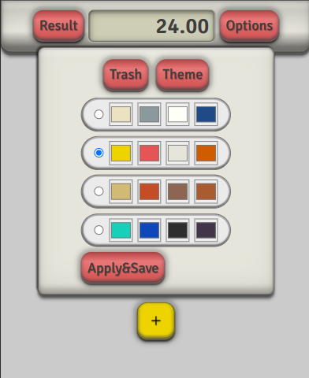
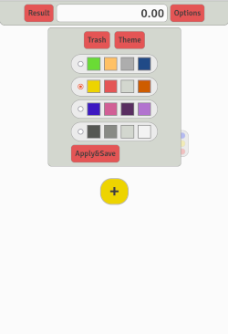

# Summator

## [SUMMATOR](https://liluter.github.io/Summator/) App for easier calculations.

    I am creating a marketplace app for sellers to get quick calculations and easy sales management.

## Summator project on [JIRA](https://awdziewicz.atlassian.net/wiki/spaces/SD/overview?atlOrigin=eyJpIjoiYmI2ODQxMWQwNzMwNDZiYjllZjhmZDE5NmQzMWQ3NDciLCJwIjoiaiJ9)

    Used Jira to manage this project.

---

## Incoming: More Save options, Day/Night style toggle.

## Upgrade 4

- Fix modOperator.
- Clear Board feature.
- Select all items in trash.
- Reset button for theme feature.
- Fix btn recovery from trash.

---

## Upgrade 3

- String validation for '.' inputs.
- Fix selection input number to empty value not "0".
- Refactor ModalOptions

---

## Upgrade 2

- Add to option modal, theme change feature.
- New ideas during sprint :

  - Reset all themes to default values.

- Refactor Trash ( form style features)
- After some style improvments.

- Refactor code.

---

## Upgrade 1

- After 1 sprint ideas

  - Improve header button style animation and hover
  - Add animations for closing item
  - Advanced logic operations with mod slider
  - Add to header history of deleted items mean Trash
  - Input main validator only numbers
  - Switch on off opacity color when turned off
  - Slider mod inside operator popup and logic
  - If mod exist mod indicator on

- Modal input slider repair closing

- Fix delete item from array

- Main Input supose to show value after modification (if mod exist)

- Old and Actual input are seen in Input Main.

- When Switch off result should update

## 

---

## MVP Sprint

- Main logic done.
- UI and almost all css styles done.

- [ ] To investigate necesity off using all operators signs in main operation modal. Maybe "+" and "-" will be enougth.

Sprinty
Epik
SAD-8

Setup Summator App development
Gotowe
Epik
SAD-16

MVP
Gotowe
Epik
SAD-23

---
